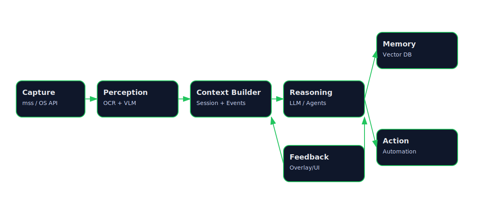

# NeuroLens


> Your computer should not just execute tasks - it should understand how you work.

NeuroLens is a public research and planning repository for a screen-aware AI
system that observes digital workflows, builds context, and improves how work
gets done.

It explores a new class of systems: **cognitive operating systems** - software
that combines perception, memory, and reasoning to augment human work in real
time.

## Status

NeuroLens is in the initial planning phase.

- The repository currently contains the project narrative, architecture, and
  execution plan.
- No production-ready implementation is published yet.
- Initial implementation work on the capture + OCR pipeline is starting.
- The current goal is to define a credible foundation before shipping code.

## Architecture

The system is designed as a layered pipeline that converts raw observation into
actionable insight.



## Why This Matters

Modern computers are good at executing instructions, but poor at understanding
intent.

Knowledge work now happens across editors, terminals, browsers, dashboards,
notes, and communication tools. The important context is fragmented, which
makes it hard to:

- understand what the user is trying to accomplish,
- detect wasted motion and context switching,
- surface the right next step at the right time,
- build durable memory around recurring workflows.

NeuroLens is an attempt to close that gap and move toward a more capable class
of systems: cognitive operating systems that actively participate in how work is performed.

## What NeuroLens Is Trying To Build

The target system should be able to:

- observe activity across the active workspace,
- extract text and visible context from what is on screen,
- infer the task or subtask in progress,
- retrieve relevant historical patterns,
- suggest or trigger better next actions.

The intended behavior is human-in-the-loop assistance, not opaque automation.

## How It Works

The planned workflow is:

1. Capture screen activity and related metadata.
2. Extract signals through OCR, vision, and heuristics.
3. Build a structured context model of the current task.
4. Run a reasoning layer over present and past context.
5. Return feedback, suggestions, or controlled actions.

In short:

Capture → Perception → Context → Reasoning → Memory → Feedback / Action

## What This Is Not

- Not a surveillance or employee monitoring tool.
- Not a generic chatbot wrapper.
- Not a fully autonomous agent replacing human control.

NeuroLens is intended to be a human-in-the-loop cognitive assistant.

## System Boundaries

NeuroLens is designed around a narrow, interpretable operating scope:

- observing on-screen activity rather than internal thoughts or external
  environments,
- assisting workflows rather than making independent decisions,
- improving execution quality rather than enforcing behavior.

The system is intentionally constrained so it remains explainable, reviewable,
and controllable.

The detailed breakdown lives in [docs/architecture.md](docs/architecture.md).

## Repository Scope

This repository is the public foundation for the project. It is meant to hold:

- problem framing,
- architecture decisions,
- the staged execution roadmap,
- research questions,
- constraints, risks, and future milestones.

It is not yet intended to present a finished product, SDK, or benchmark suite.

## Documentation

- [Architecture](docs/architecture.md)
- [Execution plan](docs/execution-plan.md)

## Design Principles

- Local-first where feasible.
- Privacy-aware handling of screen and behavioral data.
- Human approval before meaningful automation.
- Modular system boundaries so each layer can evolve independently.
- Staged validation instead of broad claims.

## Roadmap

1. Establish the public repository foundation and system design.
2. Build a narrow capture and OCR prototype.
3. Add a context builder that converts raw observations into task state.
4. Introduce reasoning and memory for useful recommendations.
5. Evaluate usefulness, latency, privacy posture, and failure modes before
   expanding automation.

The detailed phase plan lives in [docs/execution-plan.md](docs/execution-plan.md).

## Evaluation Focus (Planned)

The system will be evaluated along the following dimensions:

- usefulness of suggestions,
- latency of feedback,
- accuracy of context inference,
- user trust and perceived intrusiveness,
- privacy and data handling guarantees.

These constraints will guide implementation decisions.

## Contributing

This is an early-stage system design project. Contributions that improve
clarity, reduce ambiguity, or strengthen feasibility are especially valuable.

Useful entry points include:

- proposing architecture improvements,
- identifying edge cases and failure modes,
- suggesting better abstractions for system components,
- challenging assumptions in the current design,
- refining evaluation methodology, privacy posture, and system boundaries.

Start by opening an issue or discussion.

## Current Repository Layout

```text
.
|-- README.md
|-- LICENSE
|-- docs/
|   |-- architecture.md
|   |-- architecture.svg
|   `-- execution-plan.md
`-- .gitignore
```

## Not Included Yet

- production code,
- packaged libraries,
- benchmarks,
- deployment instructions,
- end-user applications,
- demos beyond the architecture and planning material.

Those should be added only when the implementation is narrow, testable, and
worth publishing.

## Long-Term Direction

If successful, NeuroLens could evolve into:

- a real-time cognitive layer across operating systems,
- a personal workflow intelligence engine,
- a foundation for adaptive human-AI collaboration.

This repository documents the first step in that direction.

If this direction interests you, consider starring the repository or joining
the discussion.

## License

This repository is licensed under the MIT License. See [LICENSE](LICENSE).
